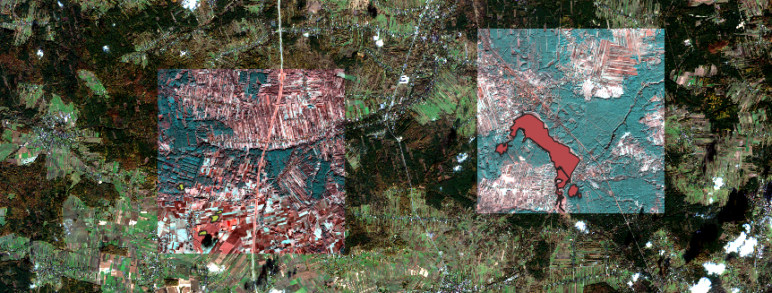

# Water body segmentation dataset load script
Python script created for loading images from dataset https://www.kaggle.com/mateuszst/water-body-segmentation-from-satellite-images
## Usage
Download dataset and unpack all files into **data** directory.
Script will load all images into 3 numpy arrays wrapped in a dictionary.
